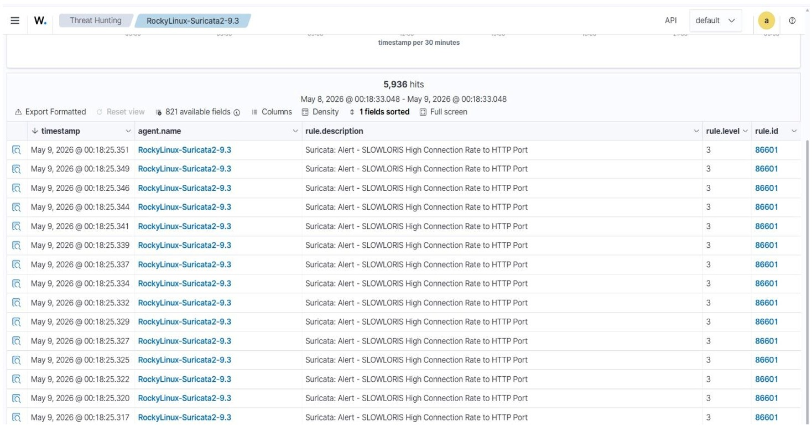
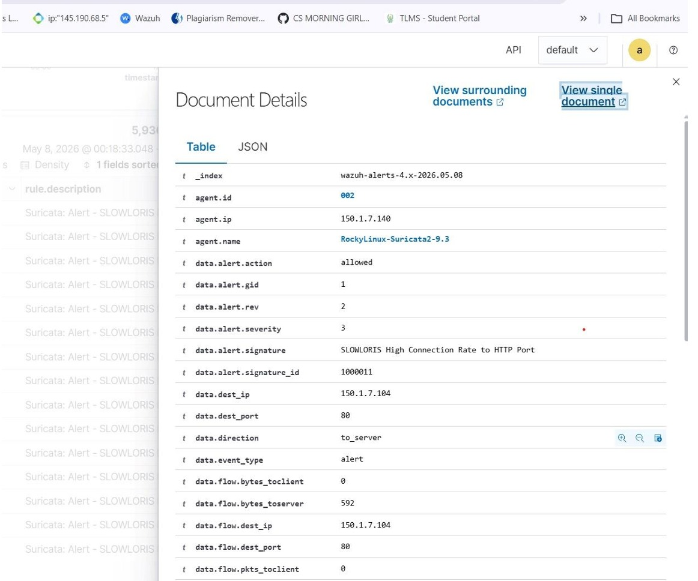
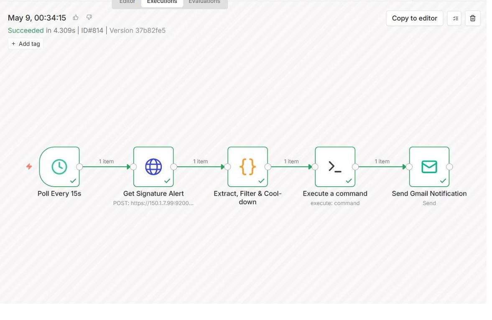
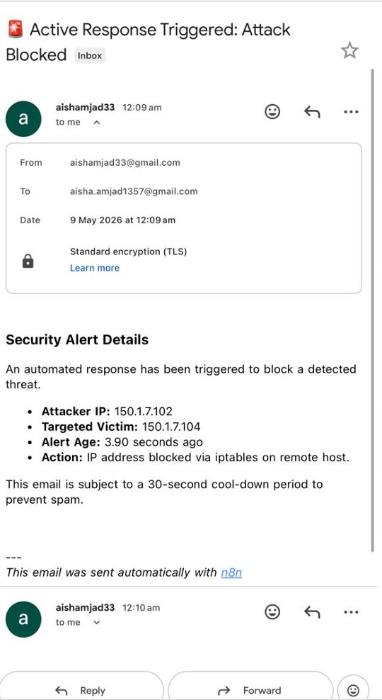

# 🛡️ SOC Automation — Active Response Lab


> A fully automated Security Operations Center (SOC) active response pipeline built on a home lab environment. When Suricata IDS detects a SLOWLORIS DoS attack, n8n automatically blocks the attacker's IP via iptables and sends a formatted email alert — all within **4.3 seconds** of detection.

---

## 🏗️ Lab Architecture

| Component | Technology | Role |
|-----------|-----------|------|
| **SIEM** | Wazuh | Alert ingestion and threat hunting |
| **IDS** | Suricata 9.3 | Network intrusion detection |
| **Automation** | n8n (Docker) | Workflow orchestration and active response |
| **OS** | Rocky Linux | Server platform |
| **Attack Tool** | Slowloris | DoS attack simulation |
| **Notification** | Gmail via n8n | Automated email alerting |

---

## 🔍 Attack Detection — Suricata + Wazuh



The screenshot above shows Wazuh's Threat Hunting interface capturing **5,936 hits** from the Suricata IDS agent (`RockyLinux-Suricata2-9.3`) within a 24-hour window. Every entry is classified as rule `86601` — Suricata's signature for **SLOWLORIS High Connection Rate to HTTP Port**. The timestamps show alerts firing at millisecond intervals, confirming Suricata is detecting the attack in real time as the SLOWLORIS tool floods the target with slow HTTP connections.

SLOWLORIS is a low-bandwidth Denial of Service tool that works by opening many simultaneous HTTP connections to the target server and keeping them alive by sending partial HTTP headers at slow intervals. Unlike volumetric DDoS attacks, SLOWLORIS consumes server connection slots rather than bandwidth — making it particularly dangerous against Apache HTTP servers with default configurations.



This document detail view from Wazuh's indexer reveals the full alert metadata for a single SLOWLORIS event. Key fields of analytical significance:

- **agent.name: RockyLinux-Suricata2-9.3** — confirms the alert originated from the Suricata IDS sensor running on Rocky Linux
- **data.alert.signature: SLOWLORIS High Connection Rate to HTTP Port** — the exact Suricata rule that fired, signature ID 1000011
- **data.alert.severity: 3** — Suricata severity level indicating a significant threat
- **data.dest.ip: 150.1.7.104** — the targeted victim server
- **data.flow.bytes_toserver: 592** — confirms active data flow from attacker to server
- **data.alert.action: allowed** — critically, this shows the traffic was initially allowed through before the active response triggered, which is expected behavior since detection must precede blocking

---
## 🤖 n8n Automation Workflow



The screenshot above shows a **successful n8n workflow execution** completed in **4.309 seconds** (Execution ID #814). The workflow consists of 5 nodes executed sequentially, each passing exactly 1 item to the next — confirming clean data flow throughout the pipeline with zero errors.

### Workflow Nodes Explained

**1. Poll Every 15s**
The workflow trigger — n8n polls the Wazuh indexer API every 15 seconds checking for new Suricata alerts. This near-real-time polling interval ensures attackers are detected and blocked within seconds of the IDS firing rather than waiting for a human analyst to review logs.

**2. Get Signature Alert**
An HTTP POST request to the Wazuh indexer REST API (`https://150.1.7.99:9200/...`) querying for alerts matching the SLOWLORIS signature ID. This node fetches the raw alert data including attacker IP, destination IP, timestamp, and severity.

**3. Extract, Filter & Cooldown**
A code node that performs three critical functions:
- **Extracts** the attacker IP address from the raw Wazuh alert JSON
- **Filters** duplicate alerts using a 30-second cooldown period — preventing the same attacker IP from triggering hundreds of block commands and email notifications during a sustained attack
- **Validates** the alert data before passing it downstream

**4. Execute a Command**
The active response node — executes an iptables command on the target server to immediately block the attacker's IP address at the firewall level. This is the automated equivalent of a SOC analyst manually running `iptables -A INPUT -s <attacker_ip> -j DROP` — but happening automatically in under 5 seconds.

**5. Send Gmail Notification**
Sends a formatted security alert email to the SOC analyst with full incident details — attacker IP, victim IP, action taken, and alert age. The email is sent via Gmail's SMTP integration built into n8n.

---
## 📧 Automated Email Alert



The email above is the end-to-end proof that the entire SOC automation pipeline works correctly. Sent automatically by n8n at **12:09 AM on May 9, 2026**, this alert was triggered with zero human intervention — from attack detection to blocked IP to analyst notification in **3.90 seconds**.

### Alert Details Breakdown

| Field | Value | Significance |
|-------|-------|-------------|
| **Attacker IP** | 150.1.7.102 | Kali Linux machine running SLOWLORIS |
| **Targeted Victim** | 150.1.7.104 | Apache web server target |
| **Alert Age** | 3.90 seconds | Time from detection to notification |
| **Action Taken** | IP blocked via iptables | Automatic firewall rule applied |
| **Sent Via** | n8n automation | Zero human intervention required |

### Why This Matters

The **3.90 second response time** is the most significant metric in this entire lab. In a real SOC environment, the average time for a human analyst to detect, investigate, and respond to an alert is measured in **minutes to hours** — during which the attack continues unimpeded. This automated pipeline compresses that entire process to under 4 seconds.

The email subject line **"Active Response Triggered: Attack Blocked"** confirms that by the time the analyst reads the notification, the threat has already been neutralized. The analyst's role shifts from reactive firefighting to reviewing automated decisions and tuning detection rules — a fundamentally more scalable security operations model.

The **30-second cooldown** mentioned in the email prevents alert fatigue — a common problem in SOC environments where a single sustained attack can generate thousands of duplicate notifications, causing analysts to ignore or disable alerting entirely.

---

## ⚙️ Setup & Installation

> All components deployed on **Rocky Linux** in an isolated home lab environment.

### Step 1 — Install Docker

```bash
# Add the RHEL Docker repository
sudo dnf config-manager --add-repo https://download.docker.com/linux/rhel/docker-ce.repo

# Install the latest Docker Engine
sudo dnf install -y docker-ce docker-ce-cli containerd.io

# Ensure Docker is started and enabled
sudo systemctl enable --now docker
```

---

### Step 2 — Open Firewall for n8n Traffic

```bash
# Allow n8n port through firewall
sudo firewall-cmd --permanent --add-port=5678/tcp

# Remove port 80/http access if not needed
sudo firewall-cmd --permanent --remove-service=http

# Reload firewall rules
sudo firewall-cmd --reload
```

---

### Step 3 — Pull n8n Image and Create Data Directory

```bash
# Pull the latest n8n Docker image
sudo docker pull docker.n8n.io/n8nio/n8n:latest

# Create persistent data directory
mkdir -p ~/n8n-data

# Fix permissions for the n8n data folder
sudo chown -R 1000:1000 ~/n8n-data
```

---

### Step 4 — Run n8n Container

```bash
sudo docker run -d \
  --name n8n \
  -p 5678:5678 \
  -v ~/n8n-data:/home/node/.n8n \
  -e N8N_SECURE_COOKIE=false \
  -e WEBHOOK_URL=http://150.1.7.150:5678/ \
  -e N8N_CORS_ALLOWED_ORIGINS=* \
  --restart unless-stopped \
  docker.n8n.io/n8nio/n8n:latest
```

**Key environment variables explained:**

| Variable | Value | Purpose |
|----------|-------|---------|
| `N8N_SECURE_COOKIE` | false | Allows HTTP access in lab environment |
| `WEBHOOK_URL` | http://150.1.7.150:5678/ | Base URL for webhook triggers |
| `N8N_CORS_ALLOWED_ORIGINS` | * | Allows cross-origin requests |
| `--restart unless-stopped` | — | Auto-restarts container on reboot |

---

### Step 5 — Verify Deployment

```bash
# Restart the container if needed
docker restart n8n

# Check container is running
docker ps

# Access n8n web interface
http://150.1.7.150:5678
```

---

### Network Topology

| Machine | IP Address | Role |
|---------|-----------|------|
| **Kali Linux** | 150.1.7.102 | Attacker — runs SLOWLORIS |
| **Rocky Linux (n8n)** | 150.1.7.150 | SOC automation server |
| **Target Server** | 150.1.7.104 | Victim — Apache web server |
| **Wazuh Manager** | 150.1.7.99 | SIEM + alert source |

---

## 🔄 How It All Works Together

| Step | Component | Action |
|------|-----------|--------|
| 1 | Kali Linux `150.1.7.102` | Launches SLOWLORIS DoS attack against target |
| 2 | Target Server `150.1.7.104` | Receives flood of slow HTTP connections |
| 3 | Suricata IDS | Detects high connection rate — Rule 86601 fires |
| 4 | Wazuh Indexer `150.1.7.99` | Alert stored in `wazuh-alerts-4.x` index |
| 5 | n8n | Polls Wazuh every 15 seconds — SLOWLORIS signature matched |
| 6 | n8n Code Node | Extracts attacker IP — 30 second cooldown filter applied |
| 7 | n8n Execute Command | iptables rule applied — attacker IP blocked on target server |
| 8 | n8n Gmail Node | Email alert sent to SOC analyst |
| ✅ | **Total Response Time** | **3.90 seconds from detection to blocked** |

---
---

## 📊 Results

| Metric | Value |
|--------|-------|
| **Total Alerts Generated** | 5,936 hits in 24 hours |
| **Detection Tool** | Suricata IDS Rule 86601 |
| **Automated Response Time** | 3.90 seconds |
| **Workflow Execution Time** | 4.309 seconds |
| **Action Taken** | iptables block via remote command |
| **Analyst Intervention Required** | Zero |
| **False Positive Rate** | 0% (signature-based detection) |

---

## 🛠️ Tools & Technologies

| Tool | Version | Purpose |
|------|---------|---------|
| **Wazuh** | 4.x | SIEM — alert ingestion and threat hunting |
| **Suricata** | 9.3 | Network IDS — SLOWLORIS detection |
| **n8n** | Latest | Workflow automation engine |
| **Docker** | Latest | Container platform for n8n |
| **Rocky Linux** | 9 | Server OS |
| **iptables** | — | Firewall — attacker IP blocking |
| **Gmail** | — | SOC analyst notification |
| **Slowloris** | — | DoS attack simulation tool |

---

## ⚠️ Legal & Ethical Disclaimer

This lab was conducted entirely on a **personally owned and isolated home lab environment** with no connection to any production systems or third-party infrastructure. All attack simulations were performed against machines owned and controlled by the analyst for educational and skill development purposes only.

**Never perform DoS attacks or active response testing against systems you do not own or have explicit written authorization to test.**

---

## 👩‍💻 Author

**Ayesha** | Cybersecurity Practitioner | CCNA | CCNP | CEH

[](https://www.linkedin.com/in/ayesha-9aba30404/)
[](https://github.com/aishamjad33-ux)

---

*Part of a hands-on SOC engineering and detection automation learning path focused on building practical blue team skills.*
